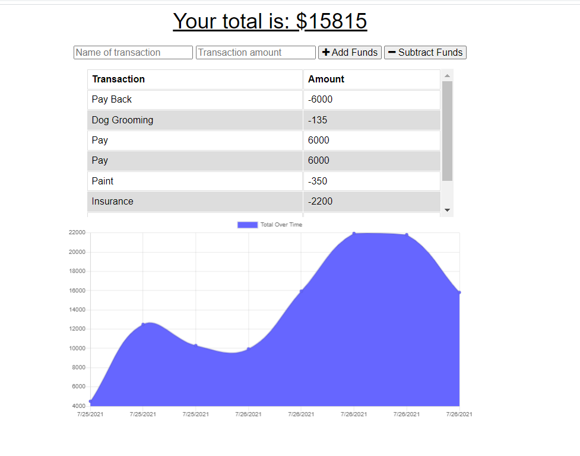
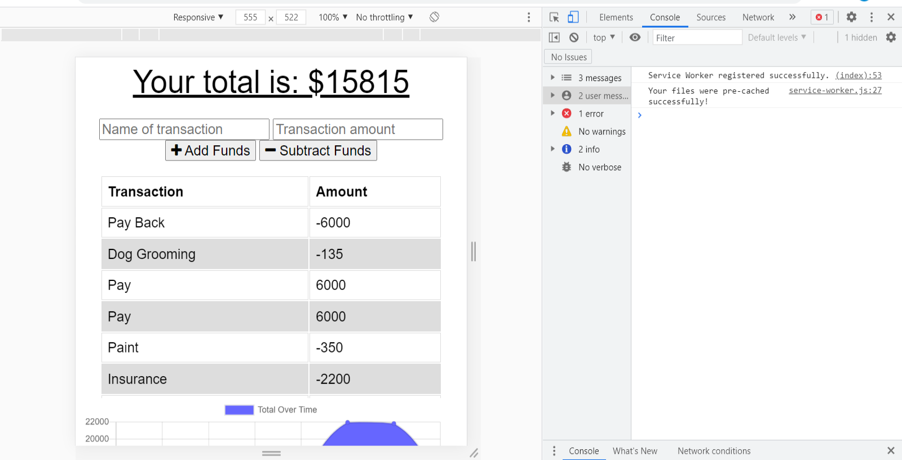
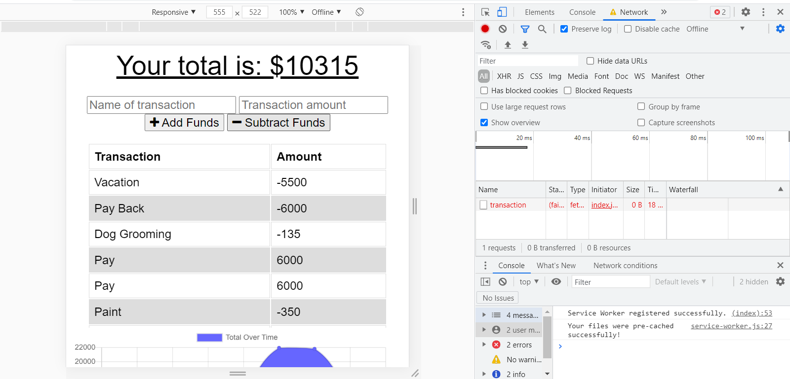
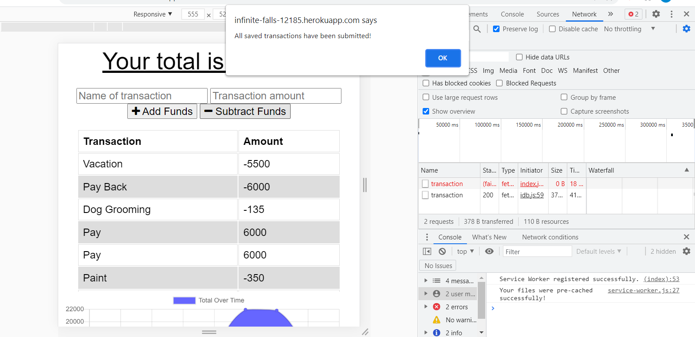
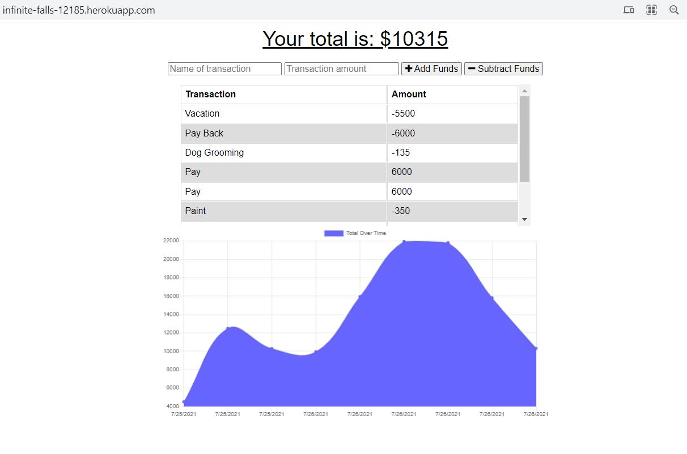

# Budget-Tracker

## Description
🔍 Added offline functionality for a budget tracker app. 

    

## Built With

    
    
    
    
    
    
    
    
    
   

   
    

## User Story
As a user, I want to enter deposits and expenses in a budget tracking app.  The app should allow for both online, and offline functionality.  When entering transactions offline, the data is cached.  When brought back online, the offline entries should be added to tracker, and the new total should populate. 

 
  

## Table of Contents
- [Description](#description)
- [Built With](#built-with)
- [User Story](#user-story)
- [Table of Contents](#table-of-contents)
- [Deployment](#deployment)
- [Screenshots](#screenshots)
- [Testing](#testing)
- [Contribution](#contribution)
- [Questions](#questions)

 

## Deployment
https://infinite-falls-12185.herokuapp.com/

 

## Screenshots

## Testing
✏️ Open Heroku site using a chrome browser.  Right click, and select inspect.  Navigate to Network tab and choose offline form the connection drop down menu. Add entries for either deposits or expenses (or both). In the Network tab, select the option "No Throttling".  Once online connection is restored, the cached data is sent.

 

## Contribution
This application was created by Trilogy for the University of Arizona. The developer has only added online functionality to this application.

 

## Questions
:telephone_receiver: Contact me with any questions: [email](mailto:kelliewerrell@gmail.com) , [GitHub](https://github.com/Kwerrell73) 